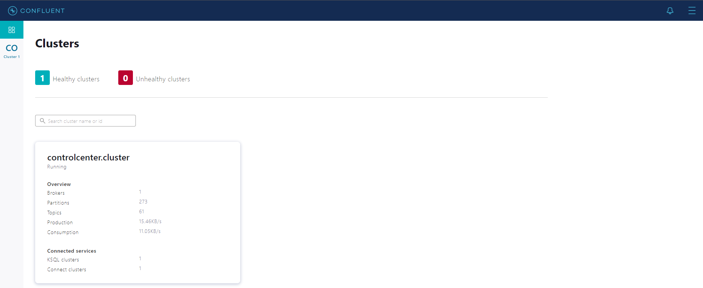

# Kafka + Spring Boot + Docker

This is an example of microservice using Spring Boot and Kafka. In this example, Kafka is using a customized [producer](src/main/java/com/kafka/microservice/config/KafkaProducerConfig.java) and [consumer](src/main/java/com/kafka/microservice/config/KafkaConsumerConfig.java), the _topic_ `KafkaMicroserviceTest`, the _groupId_ `KafkaGroupId` and the _listener_ `messageListenerFactory`.

# Running the application

1. (Optional) Terminal run `<kafka-microservice>$ docker compose pull`
2. Terminal run `<kafka-microservice>$ docker compose up`
3. Open Postman:
    - Do a POST request <localhost:8080/messages>
    - JSON

```json
{
  "message": "API with Kafka YEAH"
}
```

Output:

```Java
Listener Received: Message[message=API with Kafka YEAH, dateTime=2022-03-16T19:44:58.866397]
```

4. Confluent Control Center

http://localhost:9021/clusters



# Resources

- https://developer.confluent.io/